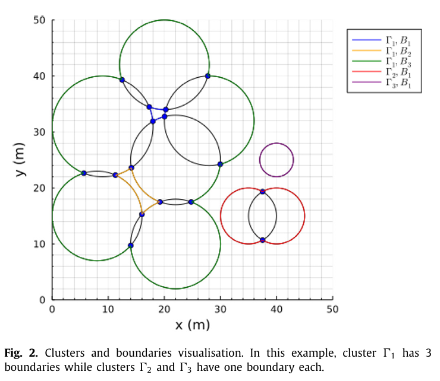

# Distributed Optimisation for Exploration and Trajectory Planning of Unmanned Aerial Vehicles

## 🧠 Description
This is my **Master’s Thesis** project. It presents a **hierarchical control framework** for a **multi-MAV (Multi-Agent Vehicle)** system tasked with exploring an environment.

We aim to **maximize the area covered** by the sensor regions of each MAV - modelled as circles.  
- The **(x, y)** position of each circle represents the **position** of an MAV. 
- The **radius** depends on the **altitude** (sensor footprint)

Once we find the optimal positions, we plan smooth, **collision-free trajectories** from their initial to target positions using **Nonlinear Model Predictive Control (NMPC)**.

📘 [View the Paper](https://doi.org/10.1016/j.ejcon.2023.100850)

📄 [View the Presentation](https://Logan1904.github.io/FYP_Hierarchical_Optimisation/FYP.pdf)

<p align="center">
  
</p>


---

## 🧩 Modules

### 🟢 `Greens_Method.jl`
Calculates the union area of overlapping circles using **Green's Theorem**.  
Inspired by the StackOverflow posts by Ants Aasma & Timothy Shields:  
👉 [StackOverflow link](https://stackoverflow.com/questions/1667310/combined-area-of-overlapping-circles)

---

### 🎯 `Position_Optimization.jl`
Maximizes the union area using the `Greens_Method` function.  
Uses **Mesh Adaptive Direct Search (MADS)** algorithm:  
🔗 [DirectSearch.jl](https://github.com/ImperialCollegeLondon/DirectSearch.jl)

---

### 🚀 `Trajectory_Optimization.jl`
Optimizes MAV trajectories using the **Altro solver** with:
- **Nonlinear dynamics**
- **NMPC**
- **Collision avoidance** via:
  - Spherical constraints
  - Additional local cost only when within a “danger distance”

🔗 [Altro.jl](https://github.com/RoboticExplorationLab/Altro.jl)

---

### 🎲 `MonteCarlo_Method.jl`
Uses **Monte Carlo simulation** to approximate union area of overlapping circles.

---

### 🧱 `Base_Functions.jl`
Utility functions used across the project.

---

### 📊 `Plotter.jl`
Visualizes the MAVs, circles, and trajectories for better understanding.

---

## 🛠️ Scripts

### 📌 `Script_MADS.jl`
1. Generates random circles  
2. Runs MADS optimization to **maximize area**

### 📌 `Script_Altro.jl`
Takes output from `Script_MADS.jl` and:
- Plans optimal trajectories  
- Ensures **collision avoidance** and **dynamics compliance**

---

## ▶️ How to Run (Julia REPL)

```julia
# Step 1: Run positional optimization
include("Script_MADS.jl")

# Step 2: Without clearing workspace, run trajectory optimization
include("Script_Altro.jl")
```
